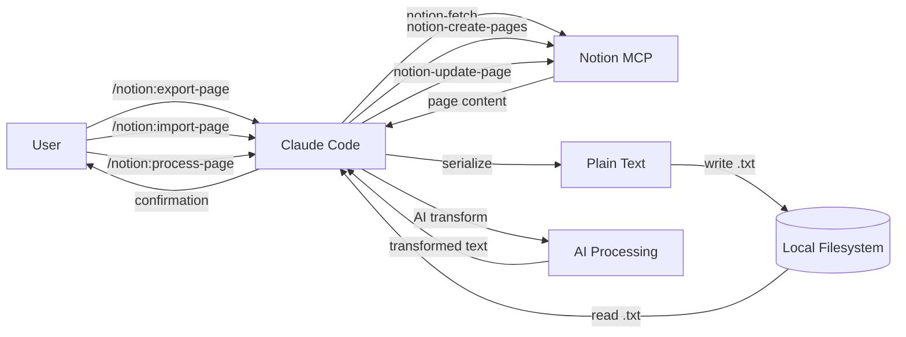

# Notion to TXT

Paste a Notion page URL, get a clean .txt file — no manual copy-paste, no formatting noise, no lock-in.

## What It Does

Export Notion pages to clean plain-text `.txt` files, import `.txt` files back into Notion, or apply AI transformations to Notion pages — all through Claude Code slash commands using Notion's official MCP integration. Content goes through an AI-assisted cleaning step that strips Notion block formatting into flat, readable text.

## Data Flow



## Quick Start

1. Open this workspace in Claude Code
2. Ensure Notion MCP is connected (`/mcp` shows Notion server)
3. Share your Notion page with the integration
4. Run: `/notion:export-page <page-url>`
5. Find your export in `./exports/`

## Architecture

- **Skills** do the work (export, import, transform, docs generation)
- **Slash commands** are shortcuts that invoke Skills
- **Notion MCP** server provides API access (no custom HTTP calls)
- **Docs Skill** is the single source for README.md and docs/ content

## Commands

### /notion:export-page

Export a single Notion page to a clean `.txt` file.

```
/notion:export-page <page-url-or-id> [--out=path] [--mode=overwrite|append]
```

| Parameter | Required | Default | Description |
|-----------|----------|---------|-------------|
| Page URL or ID | yes | — | Notion page URL or 32-char hex page ID |
| `--out` | no | `./exports/` | Output directory |
| `--mode` | no | `overwrite` | `overwrite` or `append` |

Example:
```
/notion:export-page https://www.notion.so/My-Page-abc123def456
```

### /notion:import-page

Import a local `.txt` file to Notion as a new or updated page.

```
/notion:import-page <file-path> --parent=<page-or-db-id> [--page=<page-id>] [--mode=create|update]
```

| Parameter | Required | Default | Description |
|-----------|----------|---------|-------------|
| `file-path` | yes | — | Path to local `.txt` file |
| `--parent` | yes (create) | — | Notion parent page or database URL/ID |
| `--page` | no | — | Existing page URL/ID to update |
| `--mode` | no | `create` | `create` or `update` |

Example:
```
/notion:import-page exports/my-page.txt --parent=https://notion.so/Parent-abc123
```

### /notion:process-page

Fetch a Notion page, apply an AI transformation, and save as a new Notion page.

```
/notion:process-page <page-url-or-id> --transform=<type> [--parent=<id>] [--title=<text>]
```

| Parameter | Required | Default | Description |
|-----------|----------|---------|-------------|
| Page URL or ID | yes | — | Source Notion page URL or page ID |
| `--transform` | yes | — | Transformation type or custom instruction |
| `--parent` | no | same as source | Parent for the output page |
| `--title` | no | auto-generated | Custom title for the output page |

Transform options: `summarize`, `action-items`, `translate:{lang}`, `reformat:bullets`, `reformat:outline`, `key-points`, or any free-form text.

Example:
```
/notion:process-page https://notion.so/My-Page-abc123 --transform=summarize
```

### /docs:generate

Generate all project documentation from source artifacts.

```
/docs:generate [--scope=all|readme|docs]
```

| Parameter | Required | Default | Description |
|-----------|----------|---------|-------------|
| `--scope` | no | `all` | What to generate: `all`, `readme`, or `docs` |

## Output Format

Exported `.txt` files follow this structure:

```
Title: {page title}
URL: {notion page URL}
Last edited: {date}
Tags: {comma-separated values}

---

{plain text body}
```

Content is serialized as flat, human-readable text: headings become plain text (h1 UPPERCASE, h2 Title Case, h3 as-is), lists use `- ` prefixes, quotes use `"text"`, and media appears as `[Type: caption] (url)` references.

## Setup

This is a Claude Code workspace. You need:

1. **Claude Code** CLI installed
2. **Notion MCP** connected (automatic via Claude Code's cloud integration)
3. **Pages shared** with the Notion integration

See [docs/setup.md](docs/setup.md) for detailed setup instructions.

## Troubleshooting

| Problem | Solution |
|---------|----------|
| "Page not accessible" | Share the page with the Notion integration in Notion's Share menu |
| "Invalid Notion page URL or ID" | Ensure the URL contains `notion.so` with a 32-char hex segment, or pass a raw 32-char hex ID |
| Empty export (header only) | The page has no content blocks — this is expected for blank pages |
| "File not found" | Check the file path exists when using `/notion:import-page` |
| "--transform is required" | Specify a transform type for `/notion:process-page` |
| `/mcp` doesn't show Notion | Reconnect the Notion MCP server in Claude Code |

## Project Structure

```
CLAUDE.md                                  # Workspace context and phase proofs
Skills/
  export-page.md                           # Export pipeline logic
  import-page.md                           # Import pipeline logic
  process-page.md                          # AI transformation logic
  docs-generate.md                         # Documentation generation logic
.claude/skills/
  notion:export-page/SKILL.md              # Export slash command wrapper
  notion:import-page/SKILL.md              # Import slash command wrapper
  notion:process-page/SKILL.md             # Process slash command wrapper
  docs:generate/SKILL.md                   # Docs slash command wrapper
src/
  slugify.js                               # Title-to-filename utility
exports/                                   # Default export output (gitignored)
docs/                                      # Generated reference documentation
spec/                                      # Phase specifications
.planning/                                 # Project planning files
```

## Documentation

Full reference docs in `docs/`:

- [Export Page Workflow](docs/export-page.md)
- [Import Page Workflow](docs/import-page.md)
- [Process Page Workflow](docs/process-page.md)
- [Commands Reference](docs/commands.md)
- [Setup Guide](docs/setup.md)
