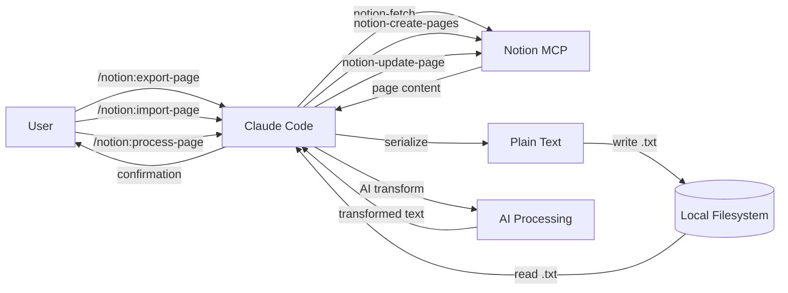

# Skill: Generate Documentation

Generate all project documentation from source artifacts. The Docs Skill is the single source of truth for `README.md` and `docs/` content.

## Parameters

- `scope` (optional) — what to generate: `all`, `readme`, or `docs` (default: `all`)

## Execution Steps

### 1. Parse Scope

Extract the `scope` parameter:
- `all` (default): generate README.md and all docs/*.md files
- `readme`: generate only README.md
- `docs`: generate only docs/*.md files

### 2. Scan Repository

Read source files to extract current project information:

| Source file | What to extract |
|-------------|-----------------|
| `.planning/PROJECT.md` | Project overview, core value, constraints |
| `.planning/REQUIREMENTS.md` | Requirements list and status |
| `Skills/export-page.md` | Export workflow steps, serialization rules table |
| `Skills/import-page.md` | Import workflow steps, text-to-blocks conversion rules |
| `Skills/process-page.md` | Process workflow steps, transformation types |
| `.claude/skills/notion:export-page/SKILL.md` | Export command syntax, parameters, error handling |
| `.claude/skills/notion:import-page/SKILL.md` | Import command syntax, parameters, error handling |
| `.claude/skills/notion:process-page/SKILL.md` | Process command syntax, parameters, error handling |
| `.claude/skills/docs:generate/SKILL.md` | Docs command syntax, parameters |
| `CLAUDE.md` | Architecture, phase proofs, constraints |
| `spec/phase2.md` | Export serialization rules reference |
| `spec/phase2b.md` | Import conversion rules reference |
| `spec/phase3b.md` | Transformation types reference |
| `src/slugify.js` | Utility info (slugify + resolve functions) |

Read each file. If a file is missing, skip it and note the gap.

### 3. Generate README.md

If scope is `all` or `readme`, generate `README.md` with these sections:

```
# Notion to TXT

{one-line tagline from PROJECT.md core value}

## What It Does

{2-3 sentence description of the full workflow: export, import, and AI processing}

## Data Flow



## Quick Start

1. Open this workspace in Claude Code
2. Ensure Notion MCP is connected (`/mcp` shows Notion server)
3. Share your Notion page with the integration
4. Run: `/notion:export-page <page-url>`
5. Find your export in `./exports/`

## Architecture

{bullet list: Skills, slash commands, Notion MCP, Docs Skill — from CLAUDE.md Architecture section}

## Commands

### /notion:export-page

{syntax, parameters table, example usage — from SKILL.md}

### /notion:import-page

{syntax, parameters table, example usage — from import SKILL.md}

### /notion:process-page

{syntax, parameters table, example usage — from process SKILL.md}

### /docs:generate

{syntax, parameters table, example usage — from docs:generate SKILL.md}

## Output Format

{header format + serialization rules summary — from export-page.md step 4}

## Setup

{brief: Claude Code workspace, Notion MCP connection, page sharing — point to docs/setup.md for details}

## Troubleshooting

{common issues: page not accessible, empty page, invalid URL — from SKILL.md error handling}

## Project Structure

{tree of key files: CLAUDE.md, Skills/, .claude/skills/, src/, exports/, docs/}

## Documentation

Full reference docs in `docs/`:
- [Export Page Workflow](docs/export-page.md)
- [Import Page Workflow](docs/import-page.md)
- [Process Page Workflow](docs/process-page.md)
- [Commands Reference](docs/commands.md)
- [Setup Guide](docs/setup.md)
```

### 4. Generate docs/export-page.md

If scope is `all` or `docs`, generate `docs/export-page.md` with:

```
# Export Page Workflow

## Overview

{what the export skill does — from Skills/export-page.md intro}

## Command

{syntax from SKILL.md}

## Parameters

{parameters table from Skills/export-page.md}

## Workflow Steps

{numbered list of the 7 steps from Skills/export-page.md}

## Serialization Rules

{full serialization rules table from Skills/export-page.md step 3}

## Rich Text Formatting

{rich text rules from Skills/export-page.md}

## Output Format

{full output format example from Skills/export-page.md step 4, including header, body, media section}

## File Naming

{slugify rules: lowercase, hyphens, collision handling from Skills/export-page.md step 5}

## Error Handling

{error cases table from SKILL.md section 4}
```

### 4b. Generate docs/import-page.md

If scope is `all` or `docs`, generate `docs/import-page.md` with:

```
# Import Page Workflow

## Overview

{what the import skill does — from Skills/import-page.md intro}

## Command

{syntax from import SKILL.md}

## Parameters

{parameters table from Skills/import-page.md}

## Workflow Steps

{numbered list of the 7 steps from Skills/import-page.md}

## Text-to-Blocks Conversion Rules

{full conversion rules table from Skills/import-page.md step 4}

## Header Property Mapping

{header properties and their Notion property mappings from Skills/import-page.md step 2}

## Create vs Update

{operation resolution logic from Skills/import-page.md step 5}

## Error Handling

{error cases table from import SKILL.md section 2 and 4}
```

### 4c. Generate docs/process-page.md

If scope is `all` or `docs`, generate `docs/process-page.md` with:

```
# Process Page Workflow

## Overview

{what the process skill does — from Skills/process-page.md intro}

## Command

{syntax from process SKILL.md}

## Parameters

{parameters table from Skills/process-page.md}

## Workflow Steps

{numbered list of the 9 steps from Skills/process-page.md}

## Transformation Types

{transformation types table from Skills/process-page.md step 4}

## Output Page

{output title generation and parent resolution from Skills/process-page.md steps 5 and 7}

## Error Handling

{error cases table from process SKILL.md section 2 and 4}
```

### 5. Generate docs/commands.md

If scope is `all` or `docs`, generate `docs/commands.md` with:

```
# Commands Reference

## /notion:export-page

{description from SKILL.md}

### Syntax

/notion:export-page <page-url-or-id> [--out=path] [--mode=overwrite|append]

### Parameters

{table: parameter, required, default, description — from SKILL.md}

### Examples

/notion:export-page https://notion.so/My-Page-abc123
/notion:export-page abc123 --out=./backup/
/notion:export-page https://notion.so/My-Page-abc123 --mode=append

### Error Messages

{table: condition → message — from SKILL.md section 2 and 4}

## /notion:import-page

{description from import SKILL.md}

### Syntax

/notion:import-page <file-path> --parent=<page-or-db-id> [--page=<page-id>] [--mode=create|update]

### Parameters

{table: parameter, required, default, description — from import SKILL.md}

### Examples

/notion:import-page exports/my-page.txt --parent=https://notion.so/Parent-Page-abc123
/notion:import-page exports/my-page.txt --page=abc123 --mode=update
/notion:import-page notes.txt --parent=abc123

### Error Messages

{table: condition → message — from import SKILL.md section 2 and 4}

## /notion:process-page

{description from process SKILL.md}

### Syntax

/notion:process-page <page-url-or-id> --transform=<type> [--parent=<id>] [--title=<text>]

### Parameters

{table: parameter, required, default, description — from process SKILL.md}

### Examples

/notion:process-page https://notion.so/My-Page-abc123 --transform=summarize
/notion:process-page abc123 --transform=translate:es
/notion:process-page abc123 --transform=action-items --title="Q4 Tasks"

### Error Messages

{table: condition → message — from process SKILL.md section 2 and 4}

## /docs:generate

{description from docs:generate SKILL.md}

### Syntax

/docs:generate [--scope=all|readme|docs]

### Parameters

{table: parameter, required, default, description}

### Examples

/docs:generate
/docs:generate --scope=readme
/docs:generate --scope=docs

### Generated Files

{table: file, content — from spec/phase4.md}
```

### 6. Generate docs/setup.md

If scope is `all` or `docs`, generate `docs/setup.md` with:

```
# Setup Guide

## Prerequisites

- Claude Code CLI installed
- Notion account with pages to export

## Connect Notion MCP

1. Open Claude Code in this workspace
2. The Notion MCP server connects automatically via Claude Code's cloud-hosted integration
3. Verify connection: run `/mcp` — should show `claude_ai_NotionMCP` server

## Share Pages with the Integration

1. Open the Notion page you want to export
2. Click "Share" in the top right
3. Invite the Notion integration (search for the connection name)
4. The page (and its children) will become accessible via MCP

## Verify Setup

1. Run `/mcp` — confirm Notion server appears
2. Try: `/notion:export-page <any-shared-page-url>`
3. Check `./exports/` for the output file

## Troubleshooting

### "Page not accessible"
The page hasn't been shared with the Notion integration. Open the page in Notion, click Share, and add the integration.

### "Invalid Notion page URL or ID"
The input doesn't look like a Notion URL or page ID. Notion URLs contain `notion.so` with a 32-character hex segment. Page IDs are 32 hex characters (with or without hyphens).

### Empty export (header only)
The page has properties but no content blocks. This is expected for blank pages. The export will include the header section and a note: "Note: page has no content blocks."

### Export directory doesn't exist
The `exports/` directory is created automatically on first export. If using `--out`, ensure the parent directory exists.
```

### 7. Write Files

Based on the scope parameter:

- If `readme` or `all`: write `README.md` at project root
- If `docs` or `all`: ensure `docs/` directory exists, write `docs/export-page.md`, `docs/import-page.md`, `docs/process-page.md`, `docs/commands.md`, `docs/setup.md`

Overwrite any existing files.

### 8. Return Confirmation

Report to the user:
- List of generated files with paths
- Scope used
- Any source files that were missing during scan
