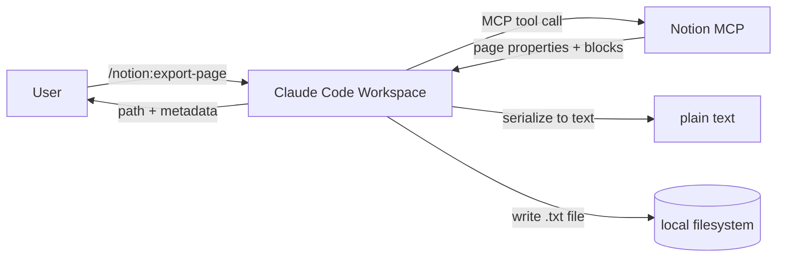

# Spec (Phases 0–3) — Notion → Local .txt Export via MCP (Claude Code + GSD)

## Core Goal
Build a local Claude Code workspace that reads content from a Notion page via the official Notion MCP integration and saves it as a `.txt` file locally. This end-to-end pipeline is the definition of done.

## Why this exists
- Replace manual copy-paste with a repeatable export workflow
- Create local, greppable backups of Notion content
- Produce `.txt` artifacts that can feed downstream workflows

## Global Constraints and Rules (apply to all phases)
- Token economy:
  - Install GSD: `npx get-shit-done-cc`
  - Use `/gsd:settings` to set budget profile to `eco`
  - Use `/cost` before each phase to track spend
  - Run work in fresh subagent contexts where possible to prevent context rot
- Code quality:
  - Zero comments in code (none)
- Documentation:
  - README and auto-generated docs are the only acceptable form of explanation
  - All documentation must be generated by a dedicated Docs Skill (no manual docs edits)
- Workflow discipline:
  - Spec first before writing code for each phase
  - Bonus phase spec is separate later (not included here) and must be visibly separated in git history

## Deliverable / Definition of Done
A working workflow exists that:
1. Fetches a Notion page by URL or page ID via MCP
2. Reads page properties and block content
3. Converts content into plain, readable text
4. Writes a `.txt` file to the local filesystem
5. Returns the output file path and key metadata

## Data Flow
1. User invokes an export slash command
2. Claude Code calls Notion MCP to retrieve page properties + blocks
3. Claude Code serializes blocks into plain text
4. Claude Code writes `.txt` to local output directory
5. User receives confirmation and output path

## Mermaid Data Flow Diagram

## What a "page" includes in v1 (single pages only)
Included:
- Text content: paragraphs, headings, lists, quotes, code blocks, to-dos
- Embedded media: references only (links or short descriptions), no binary download
- Page properties header: title always; optionally URL, last edited, created date, tags where available

Excluded:
- Child pages recursion (child pages are represented as links only)

## Output location and naming
- Default output directory: `./exports/`
- Output directory is configurable via command argument (no hardcoded absolute paths)
- File naming:
  - slugified page title, stable and deterministic
  - collision handling: append a short suffix (e.g., `-2` or short ID fragment)
- Output format:
  - header section with selected properties
  - separator line
  - body text

### Example output shape
Title: ...
URL: ...
Last edited: ...
Tags: ...

---
[body text...]

---
Media:
- [Image: caption] (url)
- [File: name] (url)

## Repository layout (initial and target)
- `.planning/PROJECT.md` (required by GSD)
- `.planning/REQUIREMENTS.md`
- `.planning/ROADMAP.md`
- `.planning/STATE.md`
- `CLAUDE.md`
- `spec/phase0.md` (this document or the Phase 0 spec content)
- `src/` (added in Phase 2)
- `skills/` (added in Phase 2–4)
- `commands/` (added in Phase 3–4)
- `exports/` (created in Phase 2, gitignored)
- `docs/` (generated in Phase 4, content generated by Docs Skill only)

## Skills and Slash Commands (v1)

### Export Skill
Purpose:
- Execute the full workflow: fetch → clean → save

Inputs:
- `page`: Notion page URL or page ID
- `out`: optional output file path or directory (default: `./exports/`)
- `mode`: optional `overwrite|append` (default: overwrite)

Outputs:
- saved `.txt` path
- minimal metadata (title, url, timestamp)

Behavior:
- Calls Notion MCP to fetch:
  - page properties
  - blocks (with pagination if needed)
- Converts blocks to plain text using deterministic rules
- Writes `.txt` to local filesystem without extra confirmation steps

### Export Slash Command
Purpose:
- Thin alias/wrapper to invoke Export Skill

Proposed name:
- `/notion:export-page`

### Docs Skill (dedicated documentation generator)
Purpose:
- Generate all documentation artifacts

Outputs:
- `README.md` (overview, setup, quick start, troubleshooting)
- `docs/` folder:
  - commands reference
  - skills reference
  - data flow reference (including Mermaid diagram)
  - serialization rules reference

Rules:
- Docs are generated exclusively by this Skill
- No manual edits to `README.md` or generated docs

### Docs Slash Command
Purpose:
- Thin alias to invoke Docs Skill

Proposed name:
- `/docs:generate`

Execution model:
- On-demand only (run explicitly before doc commits)

## Notion block-to-text serialization rules (v1)
- Headings: prefix with `#`, `##`, `###`
- Bullets: `- `
- Numbered lists: `1. `
- To-dos: `[ ]` / `[x]`
- Quotes: `> `
- Code blocks:
  - fenced with triple backticks
  - include language if available
- Divider: `---`
- Media:
  - represent as a line with label + URL if available
- Unsupported blocks:
  - emit a stable placeholder line with block type label

## CLAUDE.md contents
`CLAUDE.md` will be the session context and runbook:
- Project purpose and core goal
- Output conventions:
  - default `./exports/`
  - gitignore expectations
- Token economy discipline:
  - GSD eco profile
  - `/cost` before each phase
  - prompt hygiene: avoid pasting large content
- MCP verification steps:
  - `/mcp` confirms Notion connected
  - read 1 page
  - read 1 database
- How to run:
  - `/notion:export-page <url-or-id> [out=...]`
  - `/docs:generate [scope=...]`

## Phase-by-Phase Spec

### Phase 0 — Spec + Project Setup
Goal:
- Establish project requirements/spec and set up GSD workflow scaffolding

Deliverables:
- This spec committed as the first commit in the repo
- `.planning/PROJECT.md` present (GSD workflow requirement)
- `.planning/REQUIREMENTS.md`, `.planning/ROADMAP.md`, `.planning/STATE.md` present
- `CLAUDE.md` created with:
  - project context
  - GSD eco profile choice
  - token economy rules and `/cost` discipline
- Mermaid data flow diagram included in the spec

Rules:
- No implementation code changes in Phase 0

Checkpoint:
- Share the spec for review before proceeding to Phase 1

Success criteria:
1. Spec exists and covers Phases 1–3
2. First git commit contains the spec (and minimal planning files as needed)
3. GSD eco profile plan is documented in `CLAUDE.md`

### Phase 1 — Notion MCP Connection (no custom code)
Goal:
- Connect Claude Code to Notion via the official Notion MCP integration and verify access

Deliverables:
- Notion MCP connected and verified (`/mcp` confirms it)
- Ability to read:
  - a Notion page via MCP
  - a Notion database via MCP

Success criteria:
1. `/mcp` shows Notion MCP available/connected
2. Fetch a Notion page by URL/ID succeeds
3. Read/query a Notion database succeeds
4. `CLAUDE.md` reflects working MCP verification checklist

### Phase 2 — Export Pipeline (Skill: fetch → clean → save)
Goal:
- Implement the minimum end-to-end pipeline as an Export Skill

Deliverables:
- Export Skill that:
  - accepts a Notion URL or page ID
  - reads page properties + blocks via MCP
  - serializes to plain text
  - writes `.txt` to local filesystem

Success criteria:
1. Running Export Skill creates a `.txt` output
2. Output includes properties header + body text
3. Media appears as references (links/descriptions)
4. Output path defaults to `./exports/` and is configurable via argument
5. File naming is derived from title (slugified) with collision handling
6. Workflow runs end-to-end without manual confirmation steps

### Phase 3 — Slash command wrappers + hardening
Goal:
- Provide ergonomic command entry points and improve reliability

Deliverables:
- `/notion:export-page` slash command invoking Export Skill
- Improved error handling:
  - permission issues (page not shared with integration)
  - invalid URL/ID
  - empty pages
  - partial/unsupported blocks
- Deterministic outputs and stable formatting rules

Success criteria:
1. Slash command triggers Export Skill and produces identical output
2. Errors produce actionable messages without dumping large content
3. Export remains stable across multiple runs

## Out of Scope (for this spec)
- Bonus phase spec (to be created later as a separate document/commit)
- Recursive export of child pages
- Downloading embedded files/images
- Bidirectional sync or Notion write operations
